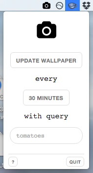

**You should consider using [Irvue - Unsplash Wallpaper](http://irvue.tumblr.com/), which has much more feature and much less bugs.**

### Unsplash Wallpaper
Unsplash Wallpaper is a menubar application that will automatically update your wallpaper at a given interval with an image from [Unsplash](https://unsplash.com). Default interval is 24 hours.

Find the pre-packaged OSX version on the [releases page](https://github.com/nddery/unsplash-wallpaper/releases).



#### Commands
```bash
npm run build
npm start
npm run publish
```
